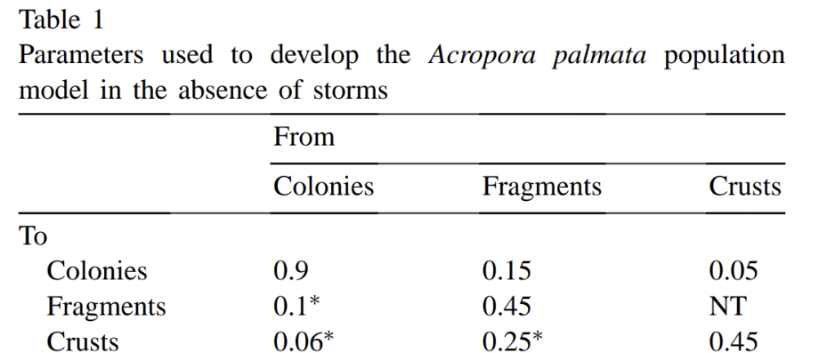

Please, using quarto (or rmarkdown), answer the questions below. You can use the class notes, the recommended books, and other web materials to help answer the questions. You can work on the homework in groups, but please independently submit a pdf document containing answers and code. If it is easier, the pdf can be converted from an html output file (i.e. print the html as pdf from web browser).

**In three weeks (11/6/25 by 11:59pm)**, please submit your pdf file to CANVAS using the following filename structure LastName_HW1_Filetype_Date (e.g., Santos_HW1_R_20251106). Again, you can share and work together on the code, but independently, submit your answers to the short answer questions in your own words and as markdown text under each question. Here are links to resources about [quarto](https://r4ds.hadley.nz/quarto).

Please reach out if you have any questions about the hw or how to make a pdf using quarto.

## Data for questions

For the majority of the homework, you will use a fish survey dataset from the Moorea Coral Reef (MCR) Long term ecological research (LTER) [site](https://mcr.lternet.edu/). This [dataset](https://portal.edirepository.org/nis/mapbrowse?packageid=knb-lter-mcr.6.62) describes the species abundance and estimated size distributions (total body length to the greatest precision possible) of fishes surveyed as part of MCR LTER's annual reef fish monitoring program. The metadata for this dataset can be found [here](https://portal.edirepository.org/nis/metadataviewer?packageid=knb-lter-mcr.6.62).

## Section 1 (38 pts)

1.  Upload the MCR LTER annual fish survey data from the course github <https://github.com/SeascapeEcologyLab-workshops/BSC6926-B52_Fall2025/blob/main/data/MCR_LTER_Annual_Fish_Survey_20230615.csv> into R-Studio. Using R, create a new dataset that includes the top species of each of the 4 coarse trophic guilds (primary consumer, piscivore, planktivore, and secondary consumer) based on the total abundance across the entire dataset. Please use Nt to name the column for abundance data. The metadata could be useful (see above) (3 pts).\

2.  Plot total annual abundance for each species with a panel for each habitat (2 pts).\

3.  Short Essay Question: How do the temporal trends of reef fish vary between habitats and trophic guilds (5 pts)?\

4.  Using R, calculate lambda from one year to the next (i.e., for each time step) for each habitat and species. Try using either a for-loop or functions (1 pt).\

5.  Calculate the mean(λ) and sd(λ) for the each habitat/species combination using your calculation from Q1.4. Remember to use the geometric mean and its standard deviation (1 pt).\

6.  Using ggplot, plot the  mean(λ) calculated in question 5 and the sd(λ). Add a horizontal line when population growth = 0. Make a panel for each habitat to compare lambdas between species (3 pts).\

7.  Based on the mean and variance in the finite rate of increase, which populations are growing on average, which populations are declining on average, and which have the highest likelihood of collapse/crash? Hint: See Gotelli Chapter 1 equation 1.9 (5 pts).\

8.  Estimate $K$ from $\lambda$ and abundance estimates at the habitat level (i.e., total population) for each species. Hint: Remember the linear relationship between density and per-capita growth rate in the density-dependent model discussed in class and the workshop (3 pts).\

9.  Using a discrete density-dependent growth model, project the population growth for each species at each habitat to 150 years based on the carrying capacity values estimated in Q8 and a starting population size of 500 individuals. Hint: $1 + r_d = \lambda$; See Gotelli pages 35-37 and pages Stevens 62-68 (3 pts).\

10. Using the discrete density-independent growth model, project the population for each species at each habitat using a random $\lambda$ the mean and sd calculated in question 6 above. Using the same starting population size of 500 individuals and for 150 years. Repeat this process 50 times and calculate the mean and standard deviation of the population size for each time step across the 50 iterations. (5 pts)\  

11.  Using ggplot, plot the population projections for each species and habitat for questions 9 and 10. For the density independent populations plot both the mean and sd of the projections, and plot one panel per species and habitat combination (2 pt).\
*-Hint: For the density independent plot, plot the trend line with error bounds*

12.  Short essay question: How do the projections for each species differ? Did the population get as far as the carrying capacity? Why or why not? If not, how many years are required to reach the carrying capacity? When at carrying capacity, do the population fluctuate around K? Why or Why not? How do the different model types compare (5 pts)\

## Section 2 (20 pts)

1.  Convert Table 1 from [Lirman et al. 2003](https://www.sciencedirect.com/science/article/pii/S0304380002003460) above into a projection matrix (1 pt).

2.  Create a starting population vector based on the life stages of this coral species: colonies (N = 100), fragments (N = 0), crust (N = 0). Project the population up to 50 years using the starting population vector and the projection matrix you created (hint: A%\*%n(t); See Stevens Chapter 2 pages 34-40) Repeat the process with 100 individuals for fragments and 0 for the other life stages.(6 pts). 

3.  Plot your results using ggplot, popbio, or base R plotting functions. Plot the projection for each stage class (2 pts).

4.  Short essay question: Looking at the plot from Q3, did the population projections reach a stable stage distribution? Why or why not? What could you tell about the fate of the populations after 50 years? How do the population sizes differ depending on the different stage specific starting abundances (5 pts)?

5.  Based on the project matrix above, calculate lambda and calculate the stable stage distribution (1 pt).

6.  Short essay question: What is the proportion between the stages at SSD? What stage is the dominant stage of the population after the stable stage distribution is reached? Why? (5 pts).

## Section 3 - Exploratory Analysis of the Community (20 pts)
1. Upload the MCR fish survey data and calculate the total abundance of each species at each habitat per year. (5pts) \

2. Identify the species that account for 75% of the abundance across the entire time series. (5 pts).\

3. Calculate the average total abundance per year at each habitat for each of the species that make up 75% of the abundance, and plot the average abundance for each species at each site using a heat map (5 pts). 
*-Hint: `geom_raster()`.*

4. *Short essay question 1.1:* Based on the heatmaps, what can you conclude about the communities/assemblages across sites? (5 pts)

## Section 4 – Univarite metrics of diversity (20 pts)
1. Using the `vegan` package or a for loop, calculate the species richness, inverse Simpson index, and Shannon index ($H$) per year for each site (5 pts).\

2. Calculate the rarefaction species richness of each habitat and year. Plot the distribution of points at each site (e.g. boxplot) (5 pts)\
*-Hint: Make a column that contains both the site and the year to use as rownames of your matrix*

3. Plot each diversity metric from question 1 and for each year and site (3 pts).\

4. *Short essay question 2.1:* Based on species richness, Simpson, and Shannon indices and rarefraction species richness, what is happening to species diversity across sites and years? What can you tell about species evenness by looking at the plot? (7 pts).\

## Section 5 - Community assemblage dissimilarities (20 pts)
1. Create a community matrix with the total abundance per species per habitat per site (5 pts).\

2. Calculate the Jaccard dissimilarity and identify which points have the lowest and highest dissimilarity (5 pts).
*-Hint: Make a column that contains both the site and the year to use as rownames of your matrix*

3. Project dissimilarity into 2-dimensional space using nonmetric multidimensional scaling and illustrate the results in a biplot (5 pts).

4. *Short essay question 3.1:* Based on the nMDS, what can you conclude about the communities/assemblages across habitats? (5 pts)

## Section 6 - Community trajectory (20 pts)

1. Plot the yearly trajectory for each habitat and site using Bray-Curtis dissimilarity on a community matrix of the top 10 species based on total abundance across all sites and habitats (5 pts).\

2. Calculate the total path length for each site/habitat combination (2 pts).

3. Plot the speed of change for each yearly time step at each site (3 pts).\

3. *Short essay question 3.1:* Based on the community trajectory, speed of change, and total path lengths, how does the community trajectory across each site/habitat compare? Are there any years where there was synchronous change at each sites or habitats? (5 pts).

